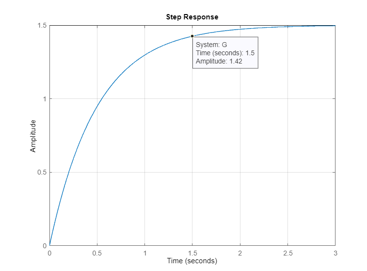
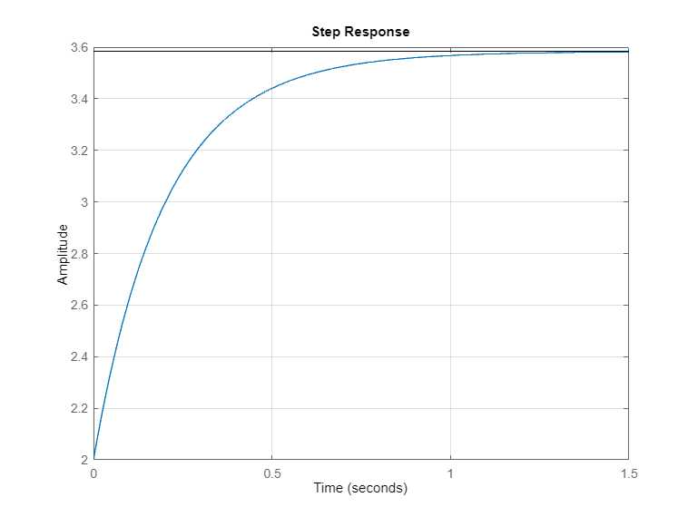

Sistemas de Controle I, Roteiro da Aula Prática 3, 19 de julho de 2023.

---

**Resumo da aula**

- comandos aprendido e/ou utilizados:
  - laplace
  - ilaplace
  - residue
  - tf2zp
  - zp2tf
  - roots
  - tf
  - step
  - series
  - parallel
  - conv

**Sumário**

- [Biblioteca Virtual](#biblioteca-virtual)
- [Sistemas LIT](#sistemas-lit)
- [Transformada de Laplace e Transformada Inversa](#transformada-de-laplace-e-transformada-inversa)
  - [Transformada de Laplace](#transformada-de-laplace)
  - [Transformada inversa de Laplace](#transformada-inversa-de-laplace)
  - [Características do sistema](#características-do-sistema)
- [Sistemas em série](#sistemas-em-série)
  - [Implementação no MATLAB](#implementação-no-matlab)
  - [Conferindo as frações parciais](#conferindo-as-frações-parciais)
- [Sistemas em paralelo](#sistemas-em-paralelo)
  - [Implementação no MATLAB](#implementação-no-matlab-1)
  - [Conferindo as frações parciais](#conferindo-as-frações-parciais-1)
  - [Reposta ao degrau](#reposta-ao-degrau)
  - [Sistema no tempo contínuo (transformada inversa de Laplace)](#sistema-no-tempo-contínuo-transformada-inversa-de-laplace)
- [Outro sistema](#outro-sistema)
  - [Função de Transferência para polos e zeros](#função-de-transferência-para-polos-e-zeros)
  - [Descobrindo raízes do denominador (ou polos)](#descobrindo-raízes-do-denominador-ou-polos)
  - [De polos e zeros para função de transferência](#de-polos-e-zeros-para-função-de-transferência)
- [Último comando](#último-comando)


## Biblioteca Virtual

Pesquisar o autor na biblioteca virtual: Ogata

Livro: 	
Engenharia de controle moderno / 2003 - (E-book)
Engenharia de sistemas de controle, Norman S. Nise. (Opcional)

Capítulo 2, Transformada de Laplace: 
- 2.1: Introdução. 
- 2.2: Revisão das variáveis complexas e das funções complexas.
- 2.3: Transformada de Laplace.
  - não ler demonstração da transformada de Laplace, função transladada, mudança de escala de tempo, comentários sobre limite inferior de Laplace.
- 2.4: Teoremoas da Transformada de Laplace
  - não ler teorema da integração real, teorema da derivada complexa, integral de convolução, transformada de Laplace do produto de duas funções no domínio do tempo.
- 2.5: Transformada Inversa de Laplace
- 2.6: Expansão em Frações Parciais com o MATLAB.

## Sistemas LIT

Dado um sistema com a seguinte função de transferência, 

$$g(t) = 3e^{-2t}$$

O sistema correspondente após aplicar a transformada de Laplace é o seguinte:

$$G(s) = \int_0^\infty g(t) e^{-st} dt$$

$$G(s) = \int_0^\infty 3 e^{-2t} e^{-st} dt$$

$$G(s) = 3 \int_0^\infty e^{-(s+2)t}dt$$

$$G(s) = 3 \left[ \frac {e^{-(s+2)t}}{- (s+2)} \Big|_{t=0}^\infty \right]$$

$$G(s) = 3 \left[ \frac {-e^{-(s+2)\infty}}{s+2} - \left( - \frac{e^{(-s+2)0}}{s+2} \right) \right]$$

$$G(s) = 3 \left[ \frac {-e^{(-s+2)0}}{s+2} - \frac{e^{-(s+2)\infty}}{s+2} \right]$$

$$G(s) = 3 \left[ \frac {1}{s+2} - \frac{0}{s+2} \right]$$

$$G(s) = 3 \frac {1}{s+2}$$

## Transformada de Laplace e Transformada Inversa

### Transformada de Laplace

Declarando funções simbólicas:

```MATLAB
syms g t
```

Função g(t):

```MATLAB
g = 3 * exp(-2 * t);
G = laplace(g)
```

A resposta deve ser: 

    G =
 
    3/(s + 2)

### Transformada inversa de Laplace

```MATLAB
f = ilaplace(G)
```

A resposta deve ser: 

    f =
 
    3*exp(-2*t)

Mesma coisa acontece quando fazendo desta maneira:

```MATLAB
syms G s
G = 3 / (s + 2)
g = ilaplace(G)
```

$$G(s) = \frac{3}{s+2}=\frac{k}{Ts + 1}$$

$$G(s) = \frac{ \frac{3}{2}} {\frac{s}{2} + \frac{2}{2}} = \frac{1.5}{0.5s + 1}$$

### Características do sistema

```MATLAB
G = tf(3, [1 2])
step(G)
grid
```

Resposta a ser observada:



Observações da imagem acima:

- Ao dar um step, a amplitude da resposta é igual a $1,5$ quando o tempo tende ao infinito. 
- O tempo em que 95% de 1,5 da amplitude ocorre é em $3 * 0.5 = 1.5 \ s$.
- 95% de 1,5 é $0.95 * 1.5 = 1.425$.

## Sistemas em série

Dois sistemas em série, como no diagrama abaixo, pode ser descrito como o produto da função de transferência de cada sistema.

$$U(s) \to G_1(s) \to G_2(s) \to Y_o(S)$$

$$\frac{ Y_o(s) } { U(s) } = G_1(s) * G_2(s) = G_3(s)$$

$$G_3(s) = \frac{ 2 } { 3s+7 } * \frac{ 5 }{ 4s + 6 } = \frac{ 10 } { as^2+bs+c } = \frac{ A } { s+a } + \frac{ B } { s+b }$$

### Implementação no MATLAB

```MATLAB
g1 = tf(2, [3 7])
g2 = tf(5, [4 6])
g3 = series(g1, g2)
```

Resposta (TODO: conferir pq a resposta do MATLAB está diferente da eq abaixo)

    g3 =
    
            10
    ------------------
    12 s^2 + 46 s + 42

$$G_3 = \frac{ 2 } { s+3 } * \frac{ 5 } { s+4 } = \frac{ 10 } { s^2 + 7s + 12 }$$

### Conferindo as frações parciais 

Frações parciais são úteis para realizar a transformada inversa de Laplace de um sistema.

$\lim_{s \to 3} \frac{ 10 } { s+4 } = \frac{ 10 } { -3+4 } = 10$

$\lim_{s \to 4} \frac{ 10 } { s+3 } = \frac{ 10 } { -4+3 } = -10$

Então:

$$g3 = \frac{ 10 } { s^2 + 7s + 12 } = \frac{ 5 } { s + 3 } - \frac{ 2 } { s + 4 }$$

```MATLAB
[r,p,k] = residue(10, [1 7 12])
```

Observações:
- r = raízes
- p = polos
- k = ganhos

Resposta:

    r =

	    -10
        10


    p =

        -4
        -3


    k =

        []

## Sistemas em paralelo

$$G(s) = 2 + \frac{3}{s+4} + \frac{5}{s+6} = \frac{A}{B}$$

### Implementação no MATLAB

```MATLAB
g1 = 2;
g2 = tf(3, [1 4]);
g3 = tf(5, [1 6]);
g4 = parallel(parallel(g1, g2), g3)
```

Resposta:

    g4 =
    
        2 s^2 + 28 s + 86
        -----------------
        s^2 + 10 s + 24


### Conferindo as frações parciais 

```MATLAB
[r,p,k] = residue([2 28 86], [1 10 24])
```

Resposta:

    r =

        5
        3


    p =

        -6.0000
        -4.0000


    k =

        2

### Reposta ao degrau



### Sistema no tempo contínuo (transformada inversa de Laplace)

$$g(t) = 2 + 5e^{-6t} + 3e^{-4t}$$

## Outro sistema

### Função de Transferência para polos e zeros

```MATLAB
[z, p, k] = tf2zp([1 2], [1 2 3])
```

Resposta:

    z =

        -2


    p =

	    -1.0000 + 1.4142i
	    -1.0000 - 1.4142i


    k =

        1

- z: zeros
- p: polos
- k: constante

### Descobrindo raízes do denominador (ou polos)

```MATLAB
roots([1 2 3])
```

Resposta:

    ans =

        -1.0000 + 1.4142i
        -1.0000 - 1.4142i

### De polos e zeros para função de transferência

```MATLAB
[num, den] = zp2tf(z, p, k)
[num, den] = zp2tf(z, p, k); tf(num, den)
```

Respostas:

    num =

        0     1     2


    den =

        1.0000    2.0000    3.0000


    ans =
    
            s + 2
        -------------
        s^2 + 2 s + 3

## Último comando

```MATLAB
den1 = [1 2 3];
den2 = [1 7 11];
den3 = conv(den1, den2)
```

Resposta:

    den3 =

        1     9    28    43    33
