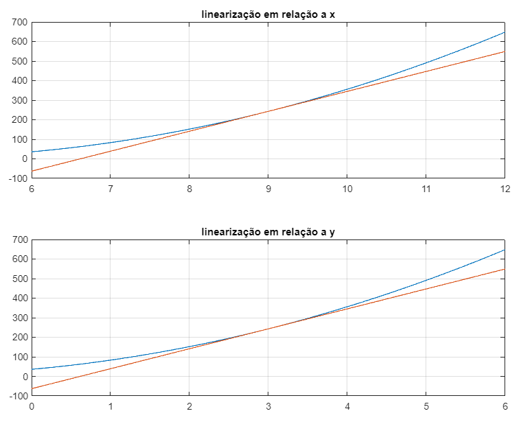
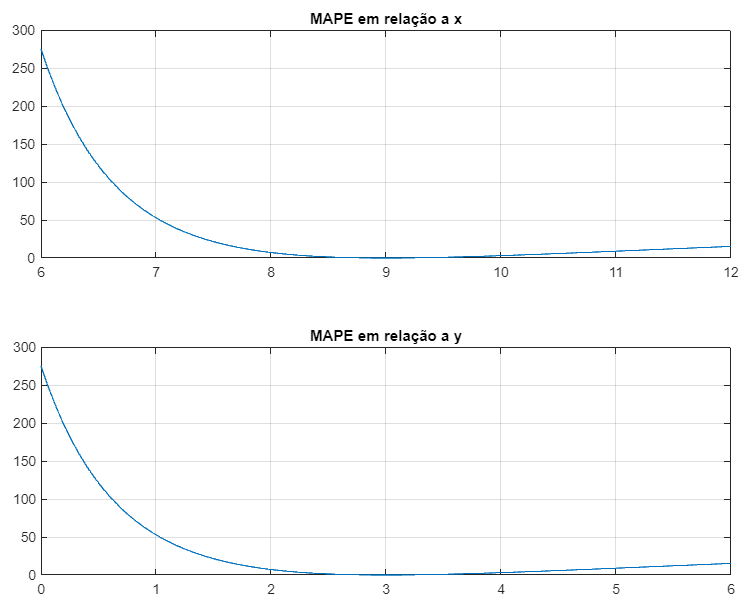
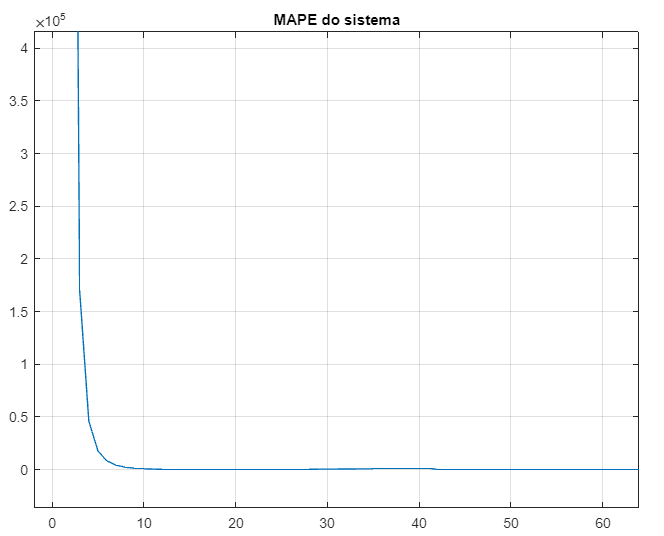

Sistemas de Controle I, Roteiro da Aula Prática 5, 02 de agosto de 2023.

---

**Resumo da aula**

Foi discutido os conceitos de funções linear, não-linear e linearização. Minimização de erros através de métodos dos mínimos quadrados.

Ademais, foi implementado a linearização e o MAPE em relação aos eixos X e Y no simulador MATLAB.

**Sumário**

- [Linearização de função não-linear](#linearização-de-função-não-linear)
  - [Cálculo da Linearização](#cálculo-da-linearização)
  - [Implementação no MATLAB](#implementação-no-matlab)
- [Exercício](#exercício)
  - [Cálculo da Linearização](#cálculo-da-linearização-1)
  - [Implementação no MATLAB](#implementação-no-matlab-1)

## Linearização de função não-linear

### Cálculo da Linearização

Considere um sistema não linear:

$$ f(x, y) = x^2 + 4xy + 6y^2 $$

com os valores de $x = [8, 10]$ e $y = [2, 4]$.

Linearizando o sistema:

$$ (z_l - \overline{z}) = \alpha(x - \overline{x}) + \beta(y - \overline{y}) $$

$$ z_l = ax + by + ( \overline{z} - a\overline{x} - b\overline{y} ) $$

Assumindo que 

$$ \overline{x} = 9; \overline{y} = 3 $$ 

então temos: 

$$ \overline{z} = 9^2 + 4 \cdot 9 \cdot 3 + 6 \cdot 3^2 = 243 $$

Descobrindo alfa e beta:

$$ \alpha = \frac{ \partial }{ \partial x } z = 2x + 4y \to 2 \overline{x} + 4 \overline{y} = 2 \cdot 9 + 4 \cdot 3 = 30 $$

$$ \beta = \frac{ \partial }{ \partial y } z = 4x + 12y \to 4 \overline{x} + 12 \overline{y} = 4 \cdot 9 + 12 \cdot 3 = 72 $$

Por fim, achamos o sistema linear: 

$$ z_l = ax + by + ( \overline{z} - a\overline{x} - b\overline{y} ) $$

$$ z_l = 30x + 72y + ( 243 - 30.9 - 72.3 ) $$

$$  z_l = 30x + 72y - 243 $$

### Implementação no MATLAB

Crie um arquivo novo e insira o código abaixo. O resultado será um gráfico da linearização (figura 1) e o MAPE (figura 2) em relação a X e Y:

```MATLAB
close all
clear all
clc

x = 6 : 0.01 : 12;
y = 0 : 0.01 : 6;

% Representando a função não linear.
% O ponto (.) usado abaixo é para multiplicação de vetor com vetor.
zo = x.^2 + 4*x.*y + 6*y.^2;

% Representando a função linear.
zl = 30*x + 72*y - 243;

% Percorrendo todo o x para definir o MAPE para cada ponto de x.
% MAPE - Mean Absolute Porcentage Error ou Erro Percentual Absoluto Médio.
for i = 1:length(x)
    mape(i) = 100 * abs( (zo(i) - zl(i)) / zo(i) );
end

figure(1)
subplot(2, 1, 1)
plot(x, zo, x, zl)
title("linearização em relação a x")
grid
subplot(2, 1, 2)
plot(y, zo, y, zl)
title("linearização em relação a y")
grid

figure(2)
subplot(2, 1, 1)
plot(x, mape)
title("MAPE em relação a x")
grid
subplot(2, 1, 2)
plot(y, mape)
title("MAPE em relação a y")
grid
```

É possível observar que o MAPE (Erro Percentual Absoluto Médio) em relação a X está abaixo de 10% quando X está no intervalo entre 7,9 e ...





## Exercício

Linearize, calcule o MAPE em relação a _x_ e faça o gráfico no MATLAB, considerando que o ponto médio em _x_ é 2 (x = 2).

### Cálculo da Linearização

$$ z = 0.2x^3 $$

Linearizando a função z:

$$ (z_l - \overline{z}) = \alpha(x - \overline{x}) $$

Calculando a média de z dado que x = 2:

$$ \overline{z} = 0.2 \cdot 2^3 = 1.6 $$

Calculando o valor de alfa:

$$ \alpha = \frac{ \partial }{ \partial x } z = \frac{ \partial }{ \partial x } 0.2x^3 = 3 \cdot 0.2x^2 = 0.6 \cdot 4 $$

$$ \alpha = 2.4 $$

Com o valor de alfa e a média de z, podemos linearizar a função z:

$$ z_l - \overline{z} = \alpha(x - \overline{x}) $$

$$ z_l = \alpha(x - \overline{x}) + \overline{z} $$

$$ z_l = 2.4(x - 2) + 1.6 $$

$$ z_l = 2.4 x - 3.2 $$

Para calcular o MAPE com x = 2:

$$ z =  0.2 x^3 = 0.2 (2)^3 = 1.6 $$

$$ z_l =  2.4 x - 3.2 = 2.4 (2) - 3.2 = 1.6 $$

### Implementação no MATLAB

```MATLAB
syms z x

z = diff(0.2 * x^3);
x_b = 2;
z_b = 0.2 * (2^3);
alfa = (3 * (2^2)) / 5;

t = 0 : 0.1 : 4;

z_origin = 0.2 * t.^3;
z_lin = alfa*t + (z_b - alfa*x_b);

for i = 1:length(t)
    mape(i) = 100 * abs( z_origin(i) - z_lin(i) / z_origin(i) );
end

figure(1)
plot(mape)
title("MAPE do sistema")
grid
```



A conclusão que podemos fazer observando o gráfico é que o sistema é extremamente sensível a valores pequenos, como pode ser visto em $x < 10$.
