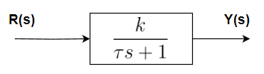
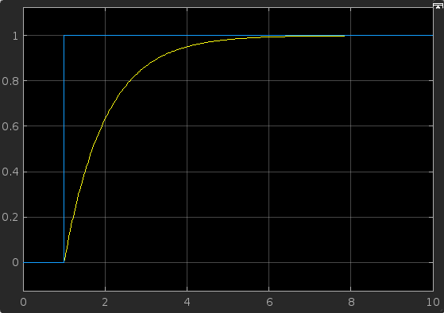
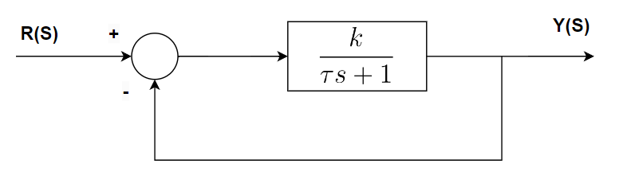
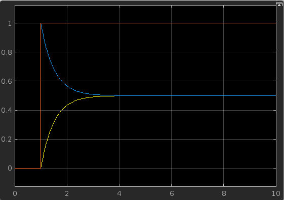
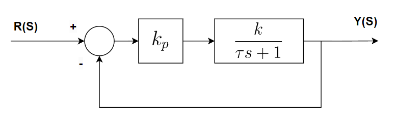
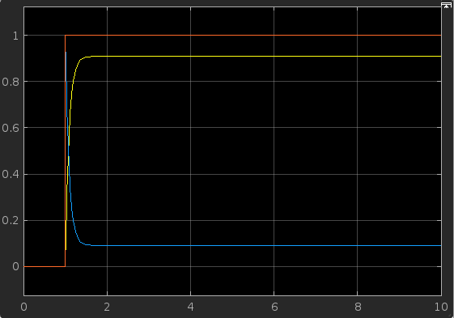
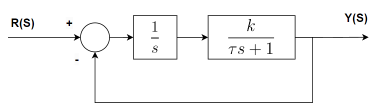
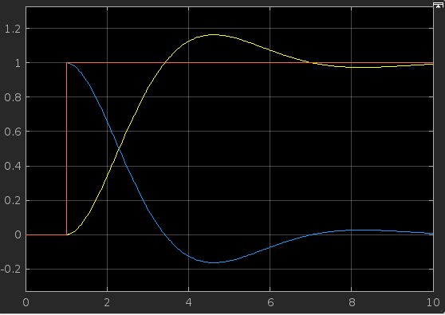

Sistemas de Controle I, Roteiro da Aula Prática 7, 16 de agosto de 2023.

---

**Resumo da aula**

TODO: colocar descrição

Foi discutido acerca dos efeitos, vantagens e desvantagens do ganho proporcional e ganho integral de um sistema, e como se comportam no regime permanente de um sistema.

**Sumário**

- [Análise de Resposta em Regime Permanente de Sistemas de 1ª Ordem.](#análise-de-resposta-em-regime-permanente-de-sistemas-de-1ª-ordem)
- [Malha Aberta](#malha-aberta)
  - [Malha Fechada](#malha-fechada)
  - [Ganho Proporcional (kp)](#ganho-proporcional-kp)
  - [Ganho Integral (ki)](#ganho-integral-ki)
- [Simulink](#simulink)

## Análise de Resposta em Regime Permanente de Sistemas de 1ª Ordem.

## Malha Aberta

Ao analisar o diagrama em blocos do sistema de controle apresentado na Figura 1, temos que:

$$ G(s) = \frac{ k }{ \tau s + 1 } = \frac{ \frac{k}{\tau} }{ s + \frac{1}{\tau} } $$

Portanto, para $R(s) = 1/s$ (degrau unitário), a resposta no tempo contínuo será:

$$ y(t) = \frac{k}{\tau} \cdot e^{- \frac{1}{\tau}  t} $$

Aplicando o Teorema do Valor Final para saber a resposta no regime permanente, temos que:

$$ y(t \to \infty) = \lim_{s \to 0} s \cdot R(s) G(s) $$

Logo:

$$ y(\infty) = \lim_{s \to 0} s \cdot \frac{ 1 }{ s } \cdot \frac{ k }{ \tau s + 1 } = \frac{ k }{ 1 } = k $$

Isso significa que o comportamento da resposta do sistema, no regime permanente, está tendendo ao ganho estático $k$.

Resposta ao degrau unitário do sistema. 

- $y(\infty) = 1$.

### Malha Fechada

Em malha fechada, teremos:

$$ y(\infty) = \lim_{s \to 0} s \cdot \frac{ 1 }{ s } \cdot \frac{ k }{ \tau s + (1 + k) } = \frac{ k }{ 1 + k }$$

Resposta ao degrau unitário do sistema. 

- $y(\infty) = 0.5$
- $\text{Erro}(\infty) = 0.5$

### Ganho Proporcional (kp)

Deste modo:

$$ y(\infty) = \lim_{s \to 0} s \cdot \frac{ 1 }{ s } \cdot \frac{ k_p \cdot k }{ \tau s + (1 + k_p \cdot k) } $$

Em que Kp é o ganho proporcional, o qual pode ser um amplificador operacional ou um registro de memória dentro do controlador.

$$ y(\infty) = \lim_{s \to 0} \frac{ k_p \cdot k }{ \tau s + (1 + k_p \cdot k) } = \frac{ k_p \cdot k }{ 1 + k_p \cdot k } $$

Quando temos que a resposta ao degrau é $\frac{ k_p \cdot k }{ 1 + k_p \cdot k }$, isso significa que, conforme o ganho proporcional $k_p$ vai aumentando diminuindo o erro. Por exemplo, dado que o set-point é igual a 1 $k = 1$, a precisão será igual a:

- Para kp = 1: $\frac{ k_p \cdot k }{ 1 + k_p \cdot k } = \frac{1}{2} = 0.5$
- Para kp = 10: $\frac{ k_p \cdot k }{ 1 + k_p \cdot k } = \frac{10}{11} = 0.909$
- Para kp = 100: $\frac{ k_p \cdot k }{ 1 + k_p \cdot k } = \frac{100}{101} = 0.990$
- Para kp = 1000: $\frac{ k_p \cdot k }{ 1 + k_p \cdot k } = \frac{1000}{1001} = 0.999$

Conforme aumenta o valor de kp, mais próximo do set-point fica a resposta ao degrau, porém sempre com uma margem de erro.

Resposta ao degrau de amplitude 10 do sistema. 

- $y(\infty) = 0.909$
- $\text{Erro}(\infty) = 0.091$

### Ganho Integral (ki)

Agora vejamos, substituindo o controlador proporcional com integral:

$$ y(\infty) = \lim_{s \to 0} s \cdot \frac{ 1 }{ s } \cdot \frac{ k_p \cdot k } { s (\tau s + 1) + k } = \frac{ k }{ k } = 1 $$

Isso significa que a resposta ao degrau será exatamento igual ao degrau unitário. Não há margem de erro como foi observado com o ganho proporcional.

Resposta ao degrau unitário do sistema. 

- $y(\infty) = 1$
- $\text{Erro}(\infty) = 0$

## Simulink

TODO: descrição do que foi feito

TODO: imagem dos circuitos

TODO: resultado de algumas simulações