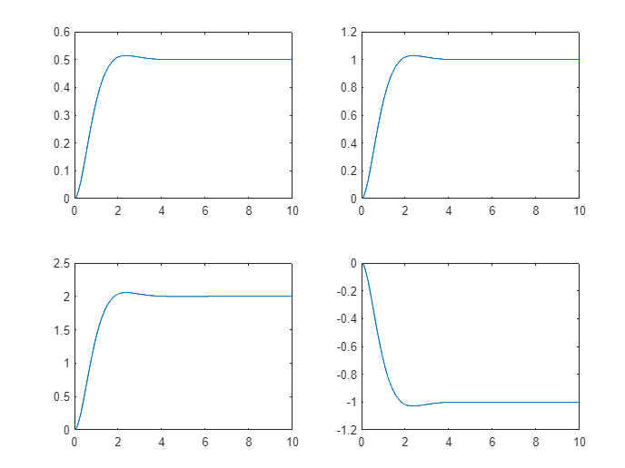
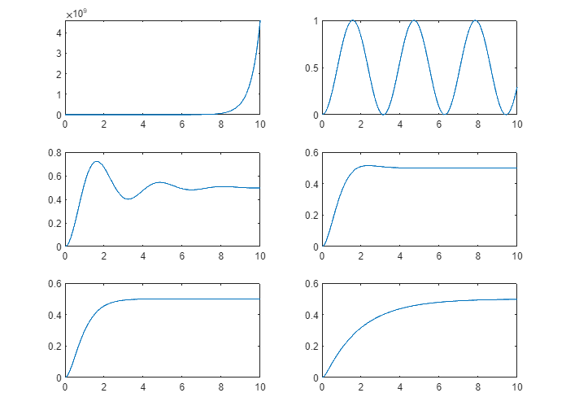
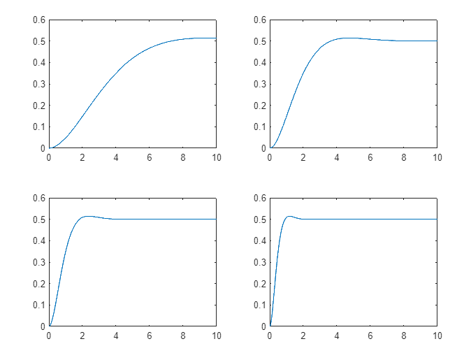
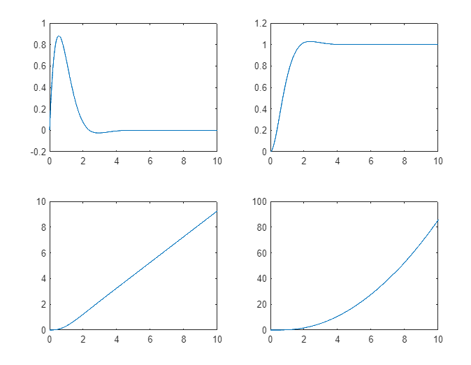

Sistemas de Controle I, Roteiro da Aula Prática 9, 30 de agosto de 2023.

---

**Resumo da aula**

Foi feito diversas simulações de respostas de um sistema de segunda ordem.

**Sumário**

TODO

## Código MATLAB

```MATLAB
close all
clear all
clc

% Sistema de Segunda Ordem
% G(s) = (k * wn^2) / (s^2 + 2*psi*wn + wn^2)

t = 0 : 0.01 : 10;

% FIGURA 1 ----------------------

k = 0.5; % k fica variando
psi = 0.75;
wn = 2;

g1 = tf( 0.5 * wn^2, [ 1 2*psi*wn wn^2 ] );
g2 = tf( 1 * wn^2, [ 1 2*psi*wn wn^2 ] );
g3 = tf( 2 * wn^2, [ 1 2*psi*wn wn^2 ] );
g4 = tf( -1 * wn^2, [ 1 2*psi*wn wn^2 ] );

[y1, x1] = step(g1, t);
[y2, x2] = step(g2, t);
[y3, x3] = step(g3, t);
[y4, x4] = step(g4, t);

figure(1)

subplot(2, 2, 1)
plot(x1, y1)

subplot(2, 2, 2)
plot(x2, y2)

subplot(2, 2, 3)
plot(x3, y3)

subplot(2, 2, 4)
plot(x4, y4)

% FIGURA 2 ----------------------

k = 0.5; 
psi = 0.75; % psi fica variando
wn = 2;

g1 = tf( k * wn^2, [ 1 2*-1*wn wn^2 ] );
g2 = tf( k * wn^2, [ 1 2*0*wn wn^2 ] );
g3 = tf( k * wn^2, [ 1 2*0.25*wn wn^2 ] );
g4 = tf( k * wn^2, [ 1 2*0.75*wn wn^2 ] );
g5 = tf( k * wn^2, [ 1 2*1*wn wn^2 ] );
g6 = tf( k * wn^2, [ 1 2*2*wn wn^2 ] );

[y1, x1] = step(g1, t)
[y2, x2] = step(g2, t)
[y3, x3] = step(g3, t)
[y4, x4] = step(g4, t)
[y5, x5] = step(g5, t)
[y6, x6] = step(g6, t)

figure(2)

subplot(3, 2, 1)
plot(x1, y1)

subplot(3, 2, 2)
plot(x2, y2)

subplot(3, 2, 3)
plot(x3, y3)

subplot(3, 2, 4)
plot(x4, y4)

subplot(3, 2, 5)
plot(x5, y5)

subplot(3, 2, 6)
plot(x6, y6)

% FIGURA 3 ----------------------

k = 0.5; 
psi = 0.75;
wn = 2; % wn fica variando

g1 = tf( k * 0.5^2, [ 1 2*psi*0.5 0.5^2 ] );
g2 = tf( k * 1^2, [ 1 2*psi*1 1^2 ] );
g3 = tf( k * 2^2, [ 1 2*psi*2 2^2 ] );
g4 = tf( k * 4^2, [ 1 2*psi*4 4^2 ] );

[y1, x1] = step(g1, t)
[y2, x2] = step(g2, t)
[y3, x3] = step(g3, t)
[y4, x4] = step(g4, t)

figure(3)

subplot(2, 2, 1)
plot(x1, y1)

subplot(2, 2, 2)
plot(x2, y2)

subplot(2, 2, 3)
plot(x3, y3)

subplot(2, 2, 4)
plot(x4, y4)

% FIGURA 4 ----------------------

% Resposta de um sistema ao impulso, degrau, rampa, parábola

k = 1; 
psi = 0.75;
wn = 2; 

g = tf( k * wn^2, [ 1 2*psi*wn wn^2 ] );

% impulso
[y1, x1] = impulse(g, t); 

% degrau
[y2, x2] = step(g, t); 

% rampa
u = t;
[y3, x3] = lsim(g, u, t); 

% parábola
u = t.^2;
[y4, x4] = lsim(g, u, t); 

figure(4)

subplot(2, 2, 1)
plot(x1, y1)

subplot(2, 2, 2)
plot(x2, y2)

subplot(2, 2, 3)
plot(x3, y3)

subplot(2, 2, 4)
plot(x4, y4)
```

## Figura 1

O tempo de estabilidade é o mesmo. O set-point varia para cada sistema.



## Figura 2



TODO: verificar resposta indo para 0.5

O fator de amortecimento psi varia para cada sistema. 

- No primeiro caso, o sistema explode pois o amortacimento está inverso.
- No segundo caso, o sistema não amortece (pois o coeficiente é 0).
- No terceiro e quarto caso, o sistema amortece. O Overshoot (o pico de subida) do primeiro é maior que do segundo.
- No quinto e sexto caso, o sistema amortece tanto que a resposta não ultrapassa o set-point. O sexto caso é mais lento.

## Figura 3



TODO: verificar resposta indo para 0.5

Wn para cada sistema varia, a velocidade do sistema é alterada. Do mais lento para mais rápido.

## Figura 4



O sistema é o mesmo. A saída vai tendendo à entrada. A entrada é diferente para cada caso:

- Impulso
- Degrau
- Rampa
- Parábola