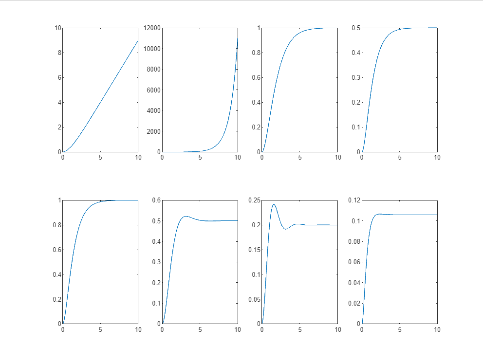
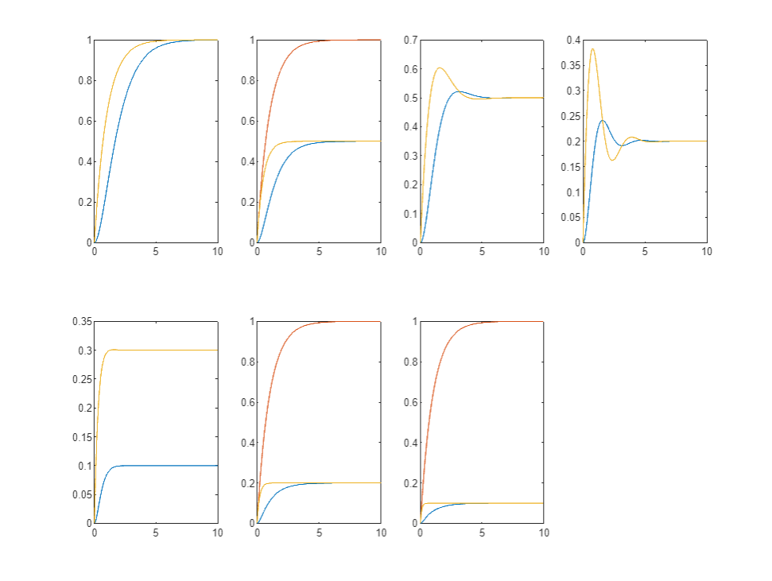

Sistemas de Controle I, Roteiro da Aula Prática 10, 06 de setembro de 2023.

---

**Resumo da aula**

Foram feitas diversas simulações de respostas de um sistema de segunda ordem para que pudessemos verificar a influência do posicionamento dos polos.

Também foram feitas implementações para verificar o fenômeno da dominância de polos.

**Sumário**

- [Posicionamento dos polos](#posicionamento-dos-polos)
  - [Código MATLAB](#código-matlab)
  - [Resultado](#resultado)
- [Dominância de Polos](#dominância-de-polos)
  - [Código MATLAB](#código-matlab-1)
  - [Resultado](#resultado-1)


## Posicionamento dos polos

### Código MATLAB

```MATLAB
close all
clear all
clc

% Análise da resposta em relação posicionamento dos polos

t = 0 : 0.01 : 10;

% FIGURA 1 ----------------------

ga = tf(1, [ 1 0 ]); gb = tf(1, [ 1 1 ]); % ga tem polo no origem, instável
g1 = series(ga, gb);

ga = tf(1, [ 1 1 ]); gb = tf(1, [ 1 -1 ]);  % gb tem polo positivo, fator de amortecimento < 0, instável
g2 = series(ga, gb);

ga = tf(1, [ 1 1 ]); gb = tf(1, [ 1 1 ]); % polos iguais, fator de amortecimento = 1, críticamente amortecido
g3 = series(ga, gb);

ga = tf(1, [ 1 1 ]); gb = tf(1, [ 1 2 ]); % fator de amortecimento maior que 1, super amortecido
g4 = series(ga, gb);

ga = tf(2, [ 1 1 ]); gb = tf(1, [ 1 2 ]); % fator de amortecimento maior que 1, super amortecido
g5 = series(ga, gb);

ga = tf(1, [ 1 1+j ]); gb = tf(1, [ 1 1-j ]); % fator de amortecimento entre 0 e 1, sub amortecido
g6 = series(ga, gb);

ga = tf(1, [ 1 1+j*2 ]); gb = tf(1, [ 1 1-j*2 ]); % aumentando a parte imaginária, aumenta o máximo de pico
g7 = series(ga, gb);

ga = tf(1, [ 1 2+j ]); gb = tf(1, [ 1 2-j ]); % aumentando a parte real, aumenta o amortecimento
g8 = series(ga, gb);

[y1, x1] = step(g1, t);
[y2, x2] = step(g2, t);
[y3, x3] = step(g3, t);
[y4, x4] = step(g4, t);
[y5, x5] = step(g5, t);
[y6, x6] = step(g6, t);
[y7, x7] = step(g7, t);
[y8, x8] = step(g8, t);

figure(1)

lin = 2;
col = 4; 

subplot(lin, col, 1)
plot(x1, y1)

subplot(lin, col, 2)
plot(x2, y2)

subplot(lin, col, 3)
plot(x3, y3)

subplot(lin, col, 4)
plot(x4, y4)

subplot(lin, col, 5)
plot(x5, y5)

subplot(lin, col, 6)
plot(x6, y6)

subplot(lin, col, 7)
plot(x7, y7)

subplot(lin, col, 8)
plot(x8, y8)
```

Lembrando que a função de transferência de um sistema de segunda ordem é definido por:

$$ G(s) = k \frac{ \omega_n^2 }{ s^2 + 2 \zeta \omega_n s + \omega_n^2 } $$

Em que:

- k: Ganho do sistema.
- $\omega_n$ (omega n): frequência natural.
- $\zeta$ (zeta): Coeficiente de amortecimento.

Ou ainda, podemos defini-lo como dois sistemas de primeira ordem:

$$ G(s) = k_1 k_2 \frac{ 1 }{ (\tau_1 s + 1) (\tau_2 s + 1) } = k_3 \frac{ 1 }{ (s + P_1) (s + P_2) } $$

- $\tau$ (tau): constante de tempo.
- P: polos do sistema.

### Resultado



Para cada sistema, haverá uma resposta diferente baseada nas propriedade do posicionamento dos polos no eixo x, y (real e imaginário).

1. Um dos polos, (s + 0), está na origem, portanto o sistema é instável.
2. Um dos polos, (s - 1), é positivo, o fator de amortecimento é menor que 0. Sistema instável.
3. Os dois polos (s + 1) são iguais, o fator de amortecimento é igual a 1. Sistema críticamente amortecido.
4. (s + 1)(s + 2) Fator de amortecimento maior que 1. Sistema super amortecido.
5. (s + 1)(s + 2) Fator de amortecimento maior que 1. Sistema super amortecido.
6. (s + 1 + j)(s + 1 - j) Fator de amortecimento entre 0 e 1. Sistema sub amortecido.
7. (s + 1 + 2j)(s + 1 - 2j) Ao aumentar a parte imaginária, aumenta o máximo de pico. Sistema sub amortecido.
8. (s + 2 + j)(s + 2 - j) Ao aumentar a parte real, aumenta o amortecimento. Sistema sub amortecido.

Ou seja:

- Polo na origem OU polo positivo: instável.
- Polos iguais reais: críticamente amortecido.
- Polos diferentes reais: super amortecido.
- Polos diferentes complexos: sub amortecido.

## Dominância de Polos

### Código MATLAB

```MATLAB
ga = tf(1, [ 1 1 ]); gb = tf(1, [ 1 1 ]);
g1 = series(ga, gb); 

gc = tf(1, [ 1 1 ]); gd = tf(1, [ 1 2 ]);
g2 = series(gc, gd); 

ge = tf(1, [ 1 1+j ]); gf = tf(1, [ 1 1-j ]);
g3 = series(ge, gf); 

gg = tf(1, [ 1 1+j*2 ]); gh = tf(1, [ 1 1-j*2 ]);
g4 = series(gg, gh);

gi = tf(1, [ 1 1+j+2 ]); gj = tf(1, [ 1 1-j+2 ]);
g5 = series(gi, gj);

gk = tf(1, [ 1 1 ]); gl = tf(1, [ 1 5 ]);
g6 = series(gk, gl);

gm = tf(1, [ 1 1 ]); gn = tf(1, [ 1 10 ]);
g7 = series(gm, gn);

[ya, xa] = step(ga, t);
[yb, xb] = step(gb, t);
[y1, x1] = step(g1, t);

[yc, xc] = step(gc, t);
[yd, xd] = step(gd, t);
[y2, x2] = step(g2, t);

[ye, xe] = step(ge, t);
[yf, xf] = step(gf, t);
[y3, x3] = step(g3, t);

[yg, xg] = step(gg, t);
[yh, xh] = step(gh, t);
[y4, x4] = step(g4, t);

[yi, xi] = step(gi, t);
[yj, xj] = step(gj, t);
[y5, x5] = step(g5, t);

[yk, xk] = step(gk, t);
[yl, xl] = step(gl, t);
[y6, x6] = step(g6, t);

[ym, xm] = step(gm, t);
[yn, xn] = step(gn, t);
[y7, x7] = step(g7, t);

% [y8, x8] = step(g8, t);

figure(2)

lin = 2;
col = 4; 

subplot(lin, col, 1)
plot(x1, y1, xa, ya, xb, yb)

subplot(lin, col, 2)
plot(x2, y2, xc, yc, xd, yd)

subplot(lin, col, 3)
plot(x3, y3, xe, ye, xf, yf)

subplot(lin, col, 4)
plot(x4, y4, xg, yg, xh, yh)

subplot(lin, col, 5)
plot(x5, y5, xi, yi, xj, yj)

subplot(lin, col, 6)
plot(x6, y6, xk, yk, xl, yl)

subplot(lin, col, 7)
plot(x7, y7, xm, ym, xn, yn)
```

### Resultado

