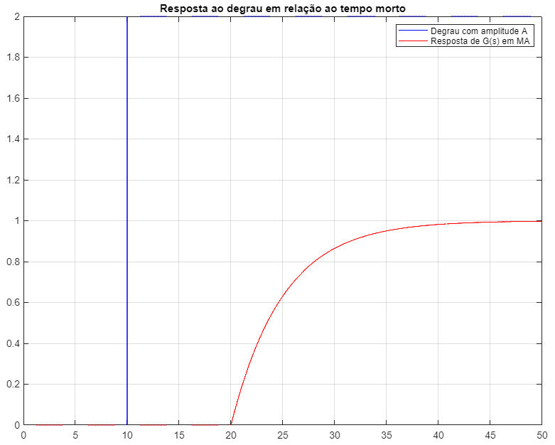
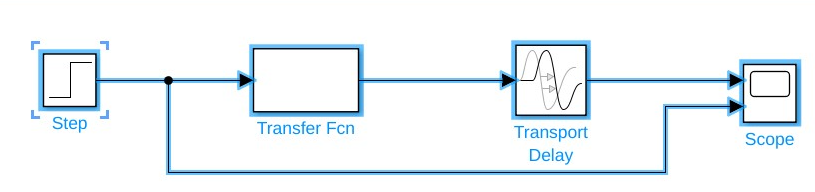
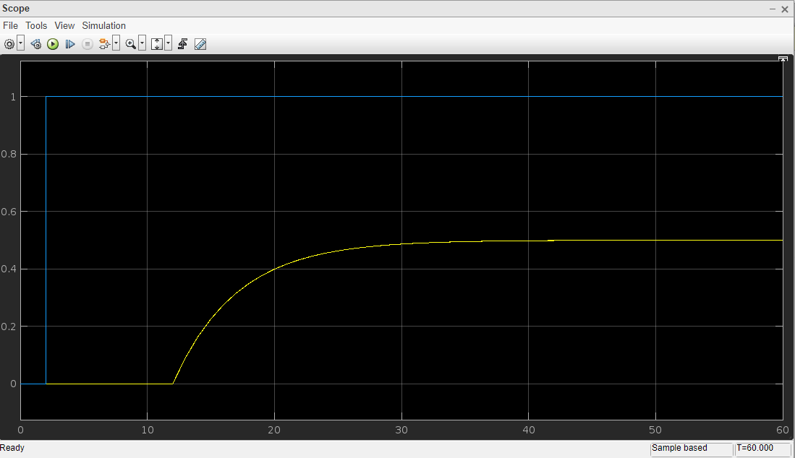

# Aula 11 - Tempo Morto e controle PID

Sistemas de Controle I, Roteiro da Aula Prática 11, 13 de setembro de 2023.

---

**Resumo da aula**

Foi discutido conceitos sobre o tempo morto $\theta$ de uma resposta dada uma entrada qualquer, e como esse tempo morto pode influenciar na constante de tempo $\tau$. 

Outros conceitos abordados foram sobre os métodos de sintonia Z&N e Fator de Incontrolabilidade $\theta / \tau$, e a influência do controlador PID dependendo do erro.

Também foram feitas implementações sobre o tempo morto.

**Sumário**
- [Aula 11 - Tempo Morto e controle PID](#aula-11---tempo-morto-e-controle-pid)
  - [Tempo Morto ou Atraso de Resposta](#tempo-morto-ou-atraso-de-resposta)
    - [MATLAB](#matlab)
      - [Código](#código)
      - [Resultado](#resultado)
    - [Simulink](#simulink)
      - [Circuito](#circuito)
      - [Resultado](#resultado-1)

## Tempo Morto ou Atraso de Resposta

Considerando que temos um sistema com o ganho $k = 5$, tempo morto $\theta$ de 10 s, constante de tempo $\tau = 5$ e atraso do input de 10 segudos.

$$ G(s) = \frac{ 0.5 }{ 5s + 1 } e^{-10s} $$

Podemos simular isso no MATLAB com o seguinte código:

### MATLAB

#### Código

```MATLAB
close all
clear all
clc
 
% Análise da resposta em relação ao tempo morto e a constante de tempo.

k = 0.5;
tau = 5;
teta = 10;

a = 2;
g = tf(k, [tau 1], 'inputdelay', teta);

t = 0: 0.001 : 50;
u = [ 
    zeros((length(t)-1)/5, 1); 
    a * ones(4 * (length(t)-1) / 5 + 1, 1 )
];

[y,x] = lsim(g, u, t);
plot(t, u, 'b',t, y, 'r');
title("Resposta ao degrau em relação ao tempo morto")
grid;
legend("Degrau com amplitude A", "Resposta de G(s) em MA");
```

#### Resultado



### Simulink

#### Circuito



#### Resultado



