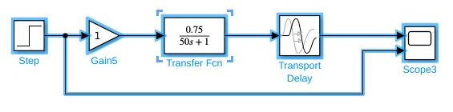
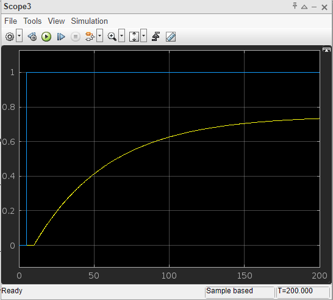
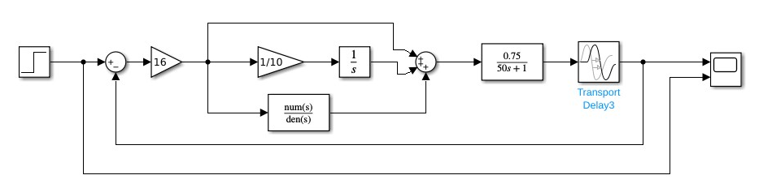
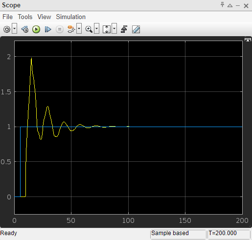

# Aula 12 - Tempo Morto e controle PID

Sistemas de Controle I, Roteiro da Aula Prática 12, 20 de setembro de 2023.

---

**Resumo da aula**

Foi modelado e simulado um sistema de controle a partir das sintonias Ziegler-Nichols de Malha Aberta, e Malha Fechada.

Além destes, foram usados os métodos de sintonia CHR (Chien, Hrones e Reswick, 1952), CC (Cohen-Coon), IAE (Integral do módulo de erro) e ITAE (Integral do módulo do erro vezes o
tempo).

**Sumário**
- [Aula 12 - Tempo Morto e controle PID](#aula-12---tempo-morto-e-controle-pid)
  - [Sintonia Ziegler-Nichols de Malha Aberta](#sintonia-ziegler-nichols-de-malha-aberta)
  - [Sintonia Ziegler-Nichols de Malha Fechada](#sintonia-ziegler-nichols-de-malha-fechada)

## Sintonia Ziegler-Nichols de Malha Aberta

Considerando que temos um sistema com o ganho $k = 0.75$, tempo morto $\theta$ de 5 s, constante de tempo $\tau = 50$ e atraso do input de 5 segudos.

$$ G(s) = \frac{ 0.75 }{ 50s + 1 } e^{-5s} $$

Montando o sistema em malha aberta no simulink:

A sua resposta ao degrau será:

Aumentando o tempo de simulação, podemos encontrar o valor de k, $\theta$, e $\tau$ observando o gráfico.

$$ k = \frac{ \Delta \text{valor que a resposta vai assentar} }{ \Delta \text{valor do set-point} } = \frac{ 0.75 }{ 1 } = 0.75 $$

$$ \theta = 5 $$

$$ 3 \tau =  \text{0.95 do valor assentado} - \theta - \text{atraso da entrada} = 50 $$

Aplicando a sintonia de Ziegler-Nichols de Malha Aberta e consideramos que usaremos um controlador PID:

Então os valores de $k_p$, $T_i$, $T_D$ serão:

$$ k_p = \frac{ 1.2 \tau }{ k \theta } = \frac{ 1.2 \cdot 50 }{ 0.75 \cdot 5  } = 16 $$

$$ T_i = 2 \theta = 2 \cdot 5 = 10 $$

$$ T_D = 0.5 \theta = 0.5 \cdot 5 = 2.5  $$

## Sintonia Ziegler-Nichols de Malha Fechada