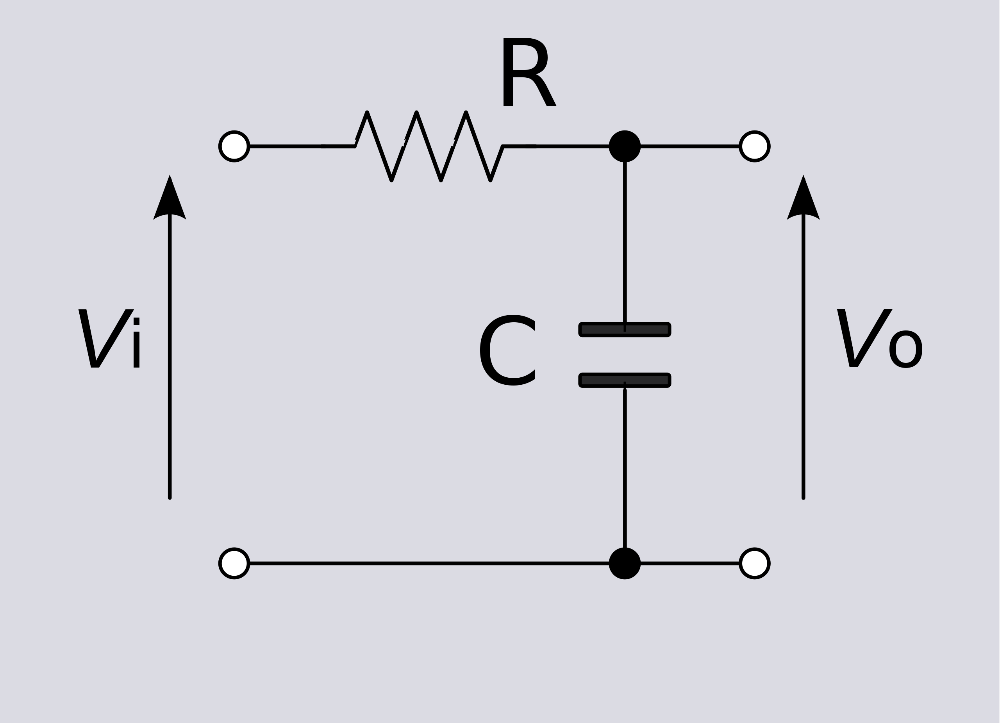
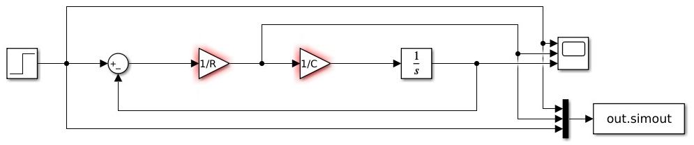
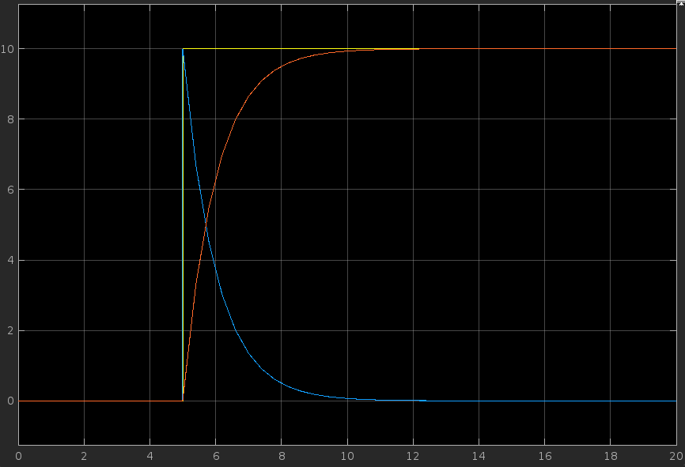
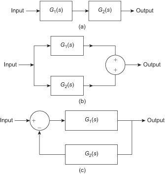
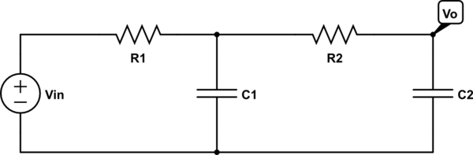

Sistemas de Controle I, Roteiro da Aula Prática 2, 12 de julho de 2023.

---

**Sumário**

- [Circuito RC](#circuito-rc)
  - [MatLab e Simulink](#matlab-e-simulink)
    - [Diagrama do circuito RC](#diagrama-do-circuito-rc)
    - [Função Transferência do sistema](#função-transferência-do-sistema)
    - [Circuito no Simulink](#circuito-no-simulink)
    - [Desenhando gráfico pelo terminal](#desenhando-gráfico-pelo-terminal)
    - [Declarando Função de Transferência do circuito](#declarando-função-de-transferência-do-circuito)
    - [Exemplo circuitos em série, paralelo e em retroalimentação negativo.](#exemplo-circuitos-em-série-paralelo-e-em-retroalimentação-negativo)
  - [Octave](#octave)
    - [Funções básicas](#funções-básicas)
- [Circuito RC de segunda ordem](#circuito-rc-de-segunda-ordem)
  - [Octave](#octave-1)
    - [Função de transferência](#função-de-transferência)
    - [Implementação](#implementação)

## Circuito RC

### MatLab e Simulink

#### Diagrama do circuito RC



#### Função Transferência do sistema

$$V_i(s) = RI(s) + V_0(s)$$

$$\frac{V_o(s)}{V_i(s)} = \frac{I(s)}{C} \frac{1}{s}$$

$$\frac{V_o(s)}{V_i(s)} = \frac{1}{RCs + 1}$$

#### Circuito no Simulink


Foram utilizados os seguintes componentes: 
- Step;
- Sum;
- Gain;
- Integrator;
- Scope (definir como 3 entradas);
- Mux (definir como 3 entradas);
- To Workspace

Os ganhos $1/R$ e $1/C$ estão dando erro pois é necessário declarar o valor de R e C no terminal do MatLab.

```matlab
R = 1; C = 1;
```

Gráfico da tensão do circuito, em que $V_i = 10 \ V$, $R = 1 \ \Omega$ e $C = 1 \ F$.


Amarelo = Entrada $V_i$
Azul = $V_R$
Vermelho = $V_C$

#### Desenhando gráfico pelo terminal

```matlab
% rodar simulação
sim('Circuito_RC.slx')	

% plotar gráfico (lembrar de rodar pelo simulink antes)
plot(out.simout) 

plot(out.simout(:, 1)) % plotar todas as linhas da coluna 1.
plot(out.simout(:, 2)) % plotar todas as linhas da coluna 2.
plot(out.simout(:, 3)) % plotar todas as linhas da coluna 3.

% tamanho do vetor da simulação do circuito.
length(out.simout) 

% plotar gráfico normalizado.
plot(0:0.4:20, out.simout(1:51, 3)) 

% plotar 3 curvas: degrau, tensão do resistor e do capacitor
t = 0:0.4:20;
plot(
	t, out.simout(1:51, 1), 'b', 
	t, out.simout(1:51, 2), 'r', 
	t, out.simout(1:51, 3), 'g'
) 
```

#### Declarando Função de Transferência do circuito

```matlab
R = 1; C = 1;

% Equivalente a: 1 / (RCs + 1)
g = tf(1, [R*C 1]) 

% aplicar degrau unitário ao sistema
step(g) 

% aplicar impulso unitário ao sistema
impulse(g) 

% vetor de zeros, uns, uns e meios, e meios negativos
u = [
	 zeros(100, 1); 
	 ones(100, 1); 
	 1.5 * ones(100, 1); 
	 -0.5 * ones(100, 1)
];

t = 0:0.1:39.9;

% simulação linear do sistema dado a entrada e o tempo.
lsim(g, u, t) 

% Plotando com a função lsim(), perdemos algumas funcionalidades do plot().
% Para contornar isso, plotamos da seguinte maneira:
y = lsim(g, u, t)
plot(
	t, u, 'b', 
	t, y, 'r'
)
```

#### Exemplo circuitos em série, paralelo e em retroalimentação negativo.

$$G_1 = \frac{s}{s + 3}$$
$$G_2 = \frac{2}{s + 7}$$



```matlab
g1 = tf(5, [1 3]);
g2 = tf(2, [1 7]);

% circuitos em série
g3 = series(g1, g2) 

% circuitos em paralelo
g4 = parallel(g1, g2)

% circuitos em feedback 
g5 = feedback(g1, g2)
```

### Octave

#### Funções básicas

```octave
% ERRO, pois não carregou o pacote de controle
g = tf(1, [1 2]) 

% carregar pacote de controle
pkg load control
g = tf(1, [1 2]) % OK

% plotar resposta ao degrau
step(g) 

% plotar resposta ao impulso
impulse(g) 
```

## Circuito RC de segunda ordem

### Octave




#### Função de transferência

$$\frac{V_i}{V_o} = \frac{1}{R_1R_2C_1C_2s^2 + (R1_C1 + R_1C_2 + R_2C_2)s + 1}$$

#### Implementação

```octave
R1 = 1; R2 = 1; C1 = 1; C2 = 1;
g = tf(1, [R1*R2*C1*C2 R1*C1+R1*C2+R2*C2 1])

% resposta ao degrau, uma curva exponencial
step(g) 

% O gráfico acima é, na verdade, uma soma de DUAS CURVAS exponenciais.
% Podemos descobrir as componentes decompondo em frações parciais.

% expansão em frações parciais
% (0,4472 / (s + 0,382)) - (0,4472 / (s + 2,618))
[r, p, k] = residue(1, [R1*R2*C1*C2 R1*C1+R1*C2+R2*C2 1]) 

% Gráfico da primeira componente
figure(2);
step(tf(0.4472, [1 0.382]))

% Gráfico da segunda componente
figure(3);
step(tf(-0.4472, [1 2.618]))
```