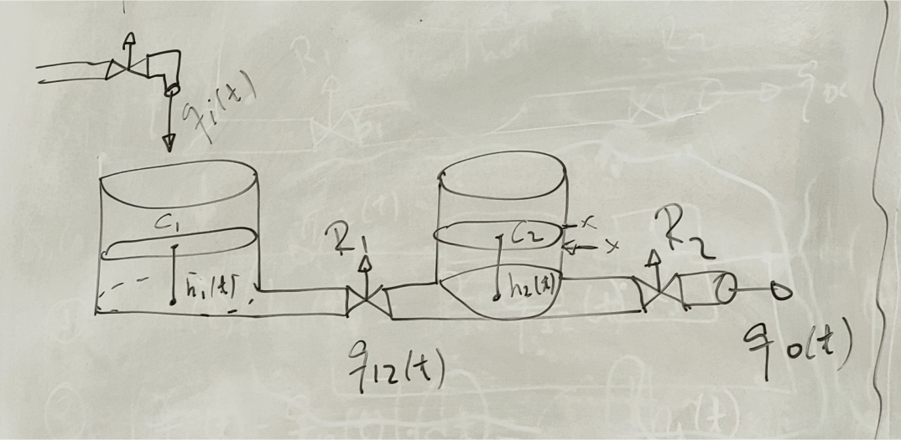
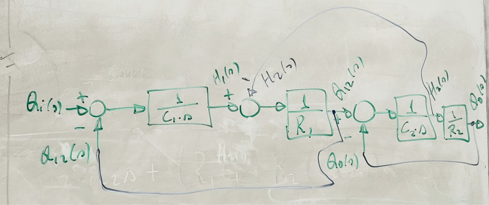
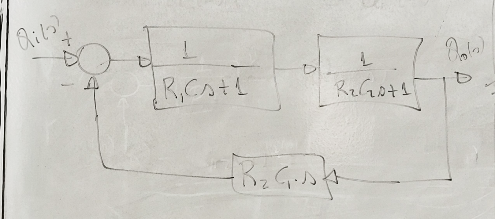
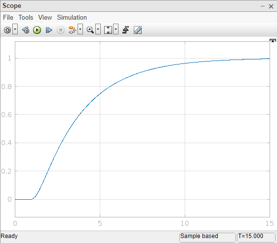
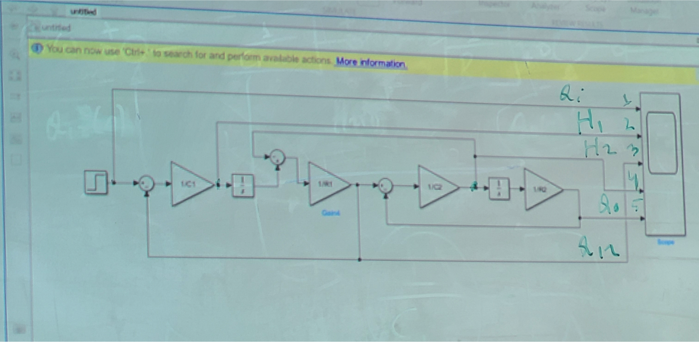

Sistemas de Controle I, Roteiro da Aula Prática 4, 26 de julho de 2023.

---

**Resumo da aula**

Foi realizada a modelagem matemática de um sistema de tanques abertos acoplados e foi feita uma simulação.

**Sumário**

- [Modelagem de Sistemas de tanques acoplados (tanque aberto)](#modelagem-de-sistemas-de-tanques-acoplados-tanque-aberto)
  - [Modelando o Sistema](#modelando-o-sistema)
  - [Montando diagrama de blocos](#montando-diagrama-de-blocos)
  - [Simplificando o diagrama de blocos](#simplificando-o-diagrama-de-blocos)
  - [Simulando no Matlab e Simulink](#simulando-no-matlab-e-simulink)


## Modelagem de Sistemas de tanques acoplados (tanque aberto)

Esquemático do sistema de tanques abertos acoplados:



### Modelando o Sistema

Considerando que temos as variáveis:

- $q_i(t)$: Vazão de Entrada
- $q_o(t)$: Vazão de Saída
- $q_{12}(t)$: Vazão do reservatório 1 para 2
- $C_{1}$: Capacitância do tanque 1
- $C_{2}$: Capacitância do tanque 2
- $R_{1}$: Resistência à passagem de água pela válvula na saída do tanque 1
- $R_{2}$: Resistência à passagem de água pela válvula na saída do tanque 2
- $h_{1}(t)$: Nível da coluna d'água no interior do tanque 1
- $h_{2}(t)$: Nível da coluna d'água no interior do tanque 2

Podemos modelá-las da seguinte maneira:

$$ q_{12}(t) = \frac { h_1(t) - h_2(t) } { R_1 } $$

$$ q_{o}(t) = \frac { h_2(t) - 0 } { R_2 } $$

$$ C_1[q_i(t) - q_{12}(t)]dt = dh_1(t) $$

$$ C_2[q_{12}(t) - q_{o}(t)]dt = dh_2(t) $$

Aplicando Transformada de Laplace em cada equação, teremos:

$$ [ H_1(s) - H_2(s) ] \frac { 1 } { R_1 } = Q_{12}(s) $$

$$ H_2(s) \frac { 1 } { R_1 } = Q_{o}(s) $$

$$ Q_i(s) - Q_{12}(s) = \frac { 1 } { C_1s } Q_{o}(s) $$

$$ Q_{12}(s) - Q_o(s) = \frac { 1 } { C_2s } H_2(s) $$

### Montando diagrama de blocos

Analisando todas as equações para montar o diagrama de blocos, e arranjando-os na ordem abaixo, obteremos:

3 -> 4 -> 1 -> 2
<!-- TODO: ou será que era 3 -> 1 -> 4 -> 2 ??? -->



### Simplificando o diagrama de blocos

Primeira simplificação do diagrama:


Segunda simplificação do diagrama:



Diagrama resultante:


### Simulando no Matlab e Simulink


Componentes utilizados:
- Step
- Sum
- Transfer fcn (também pode ser utilizado gain e integrator)
- Scope

Após montar o circuito no Simulink, será mostrado um erro dizendo que é necessário declarar as variáveis C1, C2, R1, R2. Declarando-as:

```Matlab
C1 = 1; C2 = 1; R1 = 1; R2 = 1;
```

Resultado da simulação no scope:



TODO: fazer 5 entradas para o scope.
