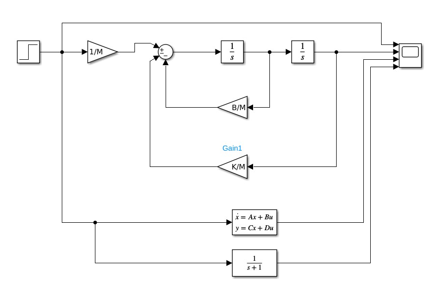

Sistemas de Controle I, Roteiro da Aula Prática 6, 09 de agosto de 2023.

---

**Resumo da aula**

Foi discutido sobre os conceitos da modelagem de um sistema massa-mola-amortecedor, representação do sistema em espaços de estados e em diagrama de blocos. Comparação entre função de transferência e espaço de estados.

**Sumário**

- [Sistema massa-mola-amortecedor](#sistema-massa-mola-amortecedor)
  - [Desenvolvimento da Função de Transferência](#desenvolvimento-da-função-de-transferência)
  - [Desenvolvimento do Espaço de Estados](#desenvolvimento-do-espaço-de-estados)
  - [Diagrama de Blocos](#diagrama-de-blocos)
  - [Relação entre função de transferência e espaço de estados](#relação-entre-função-de-transferência-e-espaço-de-estados)
- [Implementações no MATLAB](#implementações-no-matlab)
  - [Elaborando script](#elaborando-script)
  - [Simulando pelo Simulink](#simulando-pelo-simulink)


## Sistema massa-mola-amortecedor

### Desenvolvimento da Função de Transferência

Seja o sistema abaixo em que $M$ é a massa, $B$ é o coeficiente de viscosidade e $K$ é a constante elástica da mola.


Se uma força $u(t)$ for aplicada ao sistema, ocorrerá um deslocamento da massa do sistema na coordenada $y(t)$, em que assim é descrita:

$$ k \cdot y(t) + b \cdot \frac{ d } { dt } y(t) + M \cdot \frac{ d^2 } { dt^2 } y(t) = u(t) $$

Aplicando a Transformada de Laplace à expressão que descarte o dinâmico do sistema em resposta à força $u(t)$ aplicada, levando em conta as condições iniciais nulas, teremos que:

$$ k \cdot Y(s) + b \cdot Y(s) \cdot s + M \cdot Y(s) \cdot s^2 = U(s) $$

Isto é:

$$ Y(s) \cdot [ K + Bs + Ms^2 ] = U(s) $$

Portanto, a **função de transferência** que relaciona o deslocamento com a força aplicada ao sistema é:

$$ \frac{ Y(s) }{ U(s) } = \frac{ 1 }{ Ms^2 + Bs + k } $$

### Desenvolvimento do Espaço de Estados

Outra representação possível é por meio do que denominamos **Espaço de Estados**. Neste caso, vamos definir as seguintes variáveis de estados:

$$ x_1(t) = y(t) \text{ e } x_2(t) = \frac{ d } { dy } = \dot{ y }(t) $$

Observe que:

Se $x_1(t) = y(t)$ e $x_2(t) = \dot{y}(x)$, então:

$$ x_2(t) = \dot{x}_1(t) \text{ e } y = x_1(t) $$

Logo:

$$ k \cdot y(t) + B \cdot \dot{y}(t) + M \ddot{y}(t) = u(t) $$

é igual a:

$$ k \cdot x_1(t) + B \cdot x_2(t) + M \dot{x}_2(t) = u(t) $$

isto é:

$$ \dot{x}_2(t) = - \frac{ k }{ M } x_1(t) - \frac{ B }{ M } x_2(t) + \frac{ 1 }{ M } u(t) $$

também:

$$ \dot{x}_1(t) = 0 x_1(t) + 1 x_2(t) + 0 u(t) $$

A Equação de Estados Internos ficará da seguinte maneira:

$$
\begin{cases}
  \dot{x}_1(t) = 0x_1(t) + 1x_2(t) + 0u(t) \\
  \dot{x}_2(t) = - \frac{ k }{ M } x_1(t) - \frac{ B }{ M } x_2(t) + \frac{ 1 }{ M } u(t) \\
\end{cases}
$$

A saída será dada por:

$$ y(t) = 1 x_2(t) + 0 x_2(t) + 0 u(t) $$

Na forma matricial, teremos:

$$
  \left[\begin{array}{r}
    \dot{x}_1(t) \\
    \dot{x}_2(t) \\
  \end{array}\right] =
  \left[\begin{array}{rr}
    0 & 1 \\
    - \frac{ k }{ M } & - \frac{ B }{ M } \\
  \end{array}\right] \cdot
  \left[\begin{array}{r}
    x_1(t) \\
    x_2(t) \\
  \end{array}\right] +
  \left[\begin{array}{r}
    0 \\
    \frac{ 1 }{ M } \\
  \end{array}\right]
$$

$$
  \left[\begin{array}{r}
    y(t)
  \end{array}\right] =
  \left[\begin{array}{rr}
    1 & 0 \\
  \end{array}\right] \cdot
  \left[\begin{array}{r}
    x_1(t) \\
    x_2(t) \\
  \end{array}\right] +
  \left[\begin{array}{r}
    0 \\
  \end{array}\right] \cdot  
  u
$$

Temos algumas matrizes acimas que possuem identidades, dentre eles:

A = $`\begin{bmatrix} 0 & 1 \\ - \frac{ k }{ M } & - \frac{ B }{ M } \\ \end{bmatrix}`$ é a matriz de estados internos;

B = $`\begin{bmatrix} 0 \\ \frac{ 1 }{ M } \\ \end{bmatrix}`$ é o vetor de entrada;

C = $`\begin{bmatrix} 1 & 0 \\ \end{bmatrix}`$ é o vetor de saída;

D = $`\begin{bmatrix} \emptyset \end{bmatrix}`$ é o vetor de transmissão direta (offset, ou ganho estático).

A representação compacta deste sistema é:

$$
\begin{cases}
  \dot{x}(t) = A \cdot x(t) + B \cdot u(t) \\
  y(t) = C \cdot x(t) + D \cdot u(t) \\
\end{cases}
$$

### Diagrama de Blocos

Em diagrama de blocos, temos:


### Relação entre função de transferência e espaço de estados

A relação entre a função de transferência e espaço de estados pode assim ser obtido:

$$ L \{ \dot{x}(t) \} = L \{ A \cdot x(t) + B \cdot x(t) \} $$

$$ L \{ y(t) \} = L \{ C \cdot x(t) + D \cdot x(t) \} $$

$$ X(s) \cdot s = A \cdot X(s) + B \cdot U(s) $$

$$ X(s) \cdot s - A \cdot X(s) = B \cdot U(s) $$

Este $I$ abaixo significa que é uma matriz identidade.

$$ (sI - A) \cdot X(s) = B \cdot U(s) $$

Por se tratar de multiplicação matricial, a ordem abaixo importa. Faça da esquerda para direita.

$$ X(s) = (sI - A )^{-1} \cdot B \cdot U(s) $$

$$ Y(s) = C \cdot X(s) + D \cdot U(s)$$

$$ Y(s) = C \cdot (sI - A)^{-1} \cdot B \cdot U(s) + D \cdot U(s) $$

$$ Y(s) = [C \cdot (sI - A)^{-1} \cdot B + D] \cdot U(s) $$

A função de transferência calculada através das matrizes do espaço de estados é:

$$ \frac{ Y(s) }{ U(s) } = C \cdot (sI - A)^{-1} \cdot B + D $$

Considerando o ganho estático D = 0, pois na área de sistemas de controle preocupamos apenas com a parte dinâmica do sistema:

$$ \frac{ Y(s) }{ U(s) } = C \cdot (sI - A)^{-1} \cdot B $$

## Implementações no MATLAB

### Elaborando script

Definindo um sistema massa-mola-amortecedor, sua função de transferência e traduzindo para espaço de estados e vice-versa.

```MATLAB
M = 1; B = 1; K = 1;
num = 1;
%den = [M B K];
%den = [m b k];

G = tf(num, den)

% tf2ss - transfer function to steady space - função de transferência para espaço de estados
% As variáveis A, B, C, D são matrizes.
[A, B, C, D] = tf2ss(num, den)

% ss2tf - Espaço de estados para função de transferência
[NUM, DEN] = ss2tf(A, B, C, D);

tf(NUM, DEN)

% Desenhando as matrizes A, B, C, D ao step
step(A, B, C, D)
```

### Simulando pelo Simulink

TODO: simular corretamente e inserir resultado do gráfico



TODO: inserir nome dos componentes