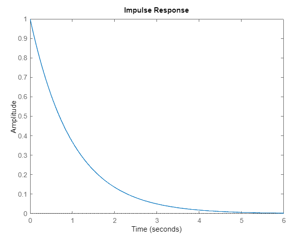

Sistemas de Controle I, Roteiro da Aula Prática 7, 16 de agosto de 2023.

---

**Resumo da aula**

Foi discutido sobre os conceitos de impulso, pulso, degrau, rampa e parábola e suas transformada direta e inversa de Laplace.

**Sumário**
- [Simulando a resposta de um sistema de primeira ordem](#simulando-a-resposta-de-um-sistema-de-primeira-ordem)
  - [Exercício](#exercício)


## Simulando a resposta de um sistema de primeira ordem

Sistema em questão:

$$ G(s) = \frac { k } { s + \alpha } $$

Resposta quando $k = 1$.

```MATLAB
k = 1; alfa = 1;

G = tf(k, [1, alfa]);

figure(1)
impulse(G)
grid()

figure(2)
step(G)
grid()
```



TODO: resposta do degrau

Resposta quando $k = 2$ e a entrada `u` é igual a 5.

```MATLAB
k = 1; alfa = 1;

t = 0 : 0.1 : 10;
u = 5 * ones(length(t), 1);

G = tf(k, [1, alfa]);

figure(1)
impulse(G)
grid()

figure(2)
step(G)
grid()
```
TODO: resposta do impulso

TODO: resposta do degrau

### Exercício

Plotar (use subplot) numa mesma figura os seguintes gráficos:

Figura 1
TODO: sistemas e resposta

Figura 2
TODO: sistemas e resposta

TODO: código no matlab

TODO: imagem dos resultados