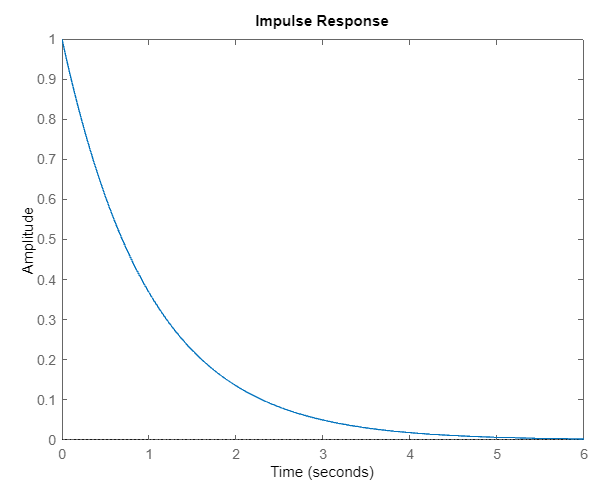
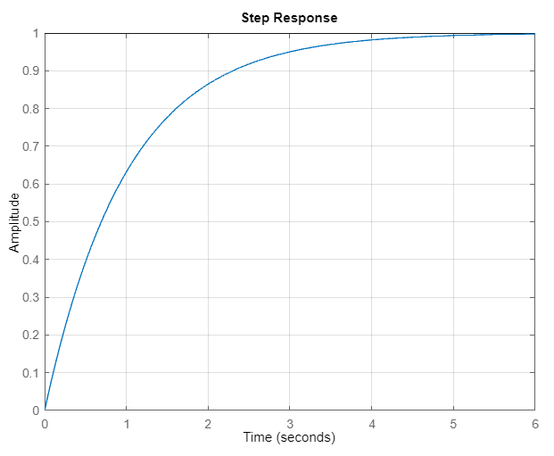
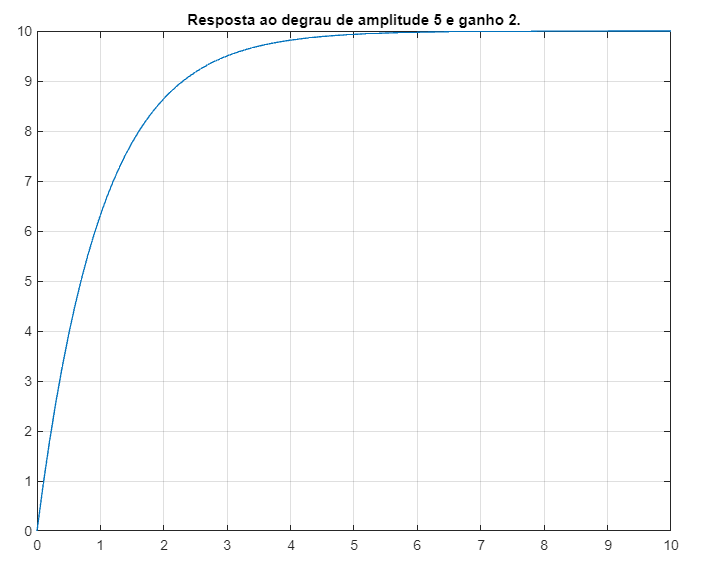
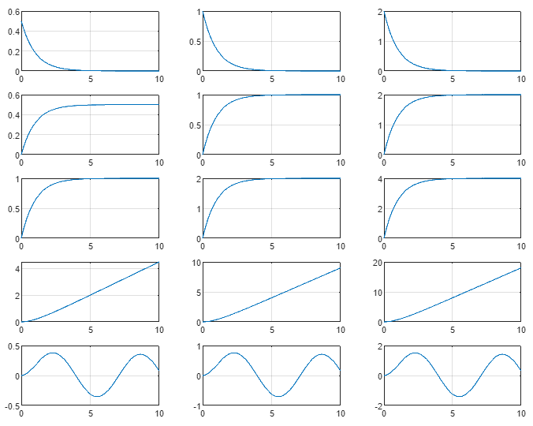
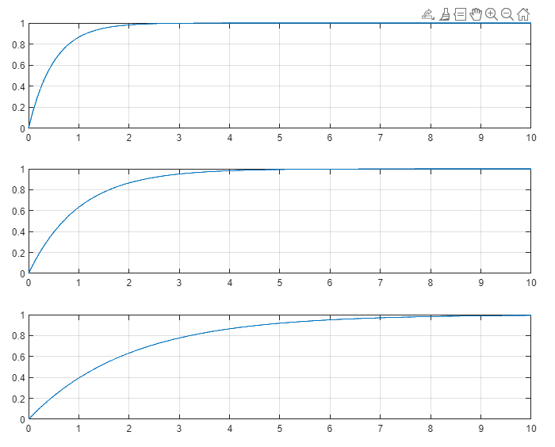

Sistemas de Controle I, Roteiro da Aula Prática 7, 16 de agosto de 2023.

---

**Resumo da aula**

Foi discutido sobre os conceitos de impulso, pulso, degrau, rampa e parábola e suas transformada direta e inversa de Laplace.

**Sumário**
- [Simulando a resposta de um sistema de primeira ordem](#simulando-a-resposta-de-um-sistema-de-primeira-ordem)
  - [Exercício](#exercício)
    - [Reoslução em MATLAB](#reoslução-em-matlab)
    - [Figura 1](#figura-1)
    - [Figura 2](#figura-2)


## Simulando a resposta de um sistema de primeira ordem

Sistema em questão:

$$ G(s) = \frac { k } { s + \alpha } $$

Resposta quando $k = 1$.

```MATLAB
k = 1; alfa = 1;

G = tf(k, [1, alfa]);

figure(1)
impulse(G)
grid()

figure(2)
step(G)
grid()
```





Resposta quando $k = 2$ e a entrada $U(s) = 5$.

```MATLAB
k = 2; alfa = 1;

t = 0 : 0.1 : 10;
u = 5 * ones(length(t), 1);

G = tf(k, [1, alfa]);

[y, x] = lsim(G, u, t);

figure(1)
plot(x, y)
grid()
title("Resposta ao degrau de amplitude 5 e ganho 2.")
```

TODO: resposta do degrau



### Exercício

Plotar (use subplot) numa mesma figura os seguintes gráficos:

Figura 1 com 5 linhas e 3 colunas em que cada célula deverá conter:

1. Resposta de $G_1 = \frac{ 0.5 }{ s + 1 }$ ao impulso unitário.
2. Resposta de $G_2 = \frac{ 1 }{ s + 1 }$ ao impulso unitário.
3. Resposta de $G_3 = \frac{ 2 }{ s + 1 }$ ao impulso unitário.
4. Resposta de $G_1$ ao degrau unitário.
5. Resposta de $G_2$ ao degrau unitário.
6. Resposta de $G_3$ ao degrau unitário.
7. Resposta de $G_1$ ao degrau de amplitude 2.
8. Resposta de $G_2$ ao degrau de amplitude 2.
9. Resposta de $G_3$ ao degrau de amplitude 2.
10. Resposta de $G_1$ a rampa unitária.
10. Resposta de $G_1$ a rampa unitária.
11. Resposta de $G_2$ a rampa unitária.
11. Resposta de $G_2$ para senoide $sin(\omega t)$ com $\omega = 1$.
12. Resposta de $G_3$ para senoide $sin(\omega t)$ com $\omega = 1$.
12. Resposta de $G_3$ para senoide $sin(\omega t)$ com $\omega = 1$.

Figura 2 com 3 linhas e 1 coluna em que cada célula deverá conter:

1. Resposta de $G_{16} = \frac{ 1 }{ 0.5s + 1 }$ ao degrau unitário.
2. Resposta de $G_{17} = G_2$ ao degrau unitário.
3. Resposta de $G_{18} = \frac{ 1 }{ 2s + 1 }$ ao degrau unitário.

#### Reoslução em MATLAB
```MATLAB
close all
clear all
clc

g1 = tf( 0.5, [1 1] );
g2 = tf( 1, [1 1] );
g3 = tf( 2, [1 1] );
g4 = tf( 1, [0.5 1] );
g5 = tf( 1, [2 1] );

t = 0 : 0.01 : 10;

% impulso
[y1,x1] = impulse(g1,t);
[y2,x2] = impulse(g2,t);
[y3,x3] = impulse(g3,t);

% degrau
[y4,x4] = step(g1,t);
[y5,x5] = step(g2,t);
[y6,x6] = step(g3,t);

% degrau de amplitude 2
u = 2*ones(length(t),1);
[y7,x7] = lsim(g1,u,t);
[y8,x8] = lsim(g2,u,t);
[y9,x9] = lsim(g3,u,t);

% rampa
u = t;
[y10,x10] = lsim(g1,u,t);
[y11,x11] = lsim(g2,u,t);
[y12,x12] = lsim(g3,u,t);

% senoidal
u = sin(t);
[y13,x13] = lsim(g1,u,t);
[y14,x14] = lsim(g2,u,t);
[y15,x15] = lsim(g3,u,t);

[y16,x16] = step(g4,t);
[y17,x17] = step(g2,t);
[y18,x18] = step(g5,t);

u = sin(t);
[y19,x19] = lsim(g1,0.5*sin(t),t);
[y20,x20] = lsim(g2,sin(t),t);
[y21,x21] = lsim(g3,2*sin(t),t);

[y22,x22] = lsim(g1,sin(0.5*t),t);
[y23,x23] = lsim(g2,sin(t),t);
[y24,x24] = lsim(g3,2*sin(2*t),t);

[y25,x25] = lsim(g1,0.5+sin(t),t);
[y26,x26] = lsim(g2,sin(t),t);
[y27,x27] = lsim(g3,2+sin(2*t),t);

figure(1)

subplot(5,3,1)
plot(x1,y1)
grid
subplot(5,3,2)
plot(x2,y2)
grid
subplot(5,3,3)
plot(x3,y3)
grid

subplot(5,3,4)
plot(x4,y4)
grid
subplot(5,3,5)
plot(x5,y5)
grid
subplot(5,3,6)
plot(x6,y6)
grid

subplot(5,3,7)
plot(x7,y7)
grid
subplot(5,3,8)
plot(x8,y8)
grid
subplot(5,3,9)
plot(x9,y9)
grid

subplot(5,3,10)
plot(x10,y10)
grid
subplot(5,3,11)
plot(x11,y11)
grid
subplot(5,3,12)
plot(x12,y12)
grid

subplot(5,3,13)
plot(x13,y13)
grid
subplot(5,3,14)
plot(x14,y14)
grid
subplot(5,3,15)
plot(x15,y15)
grid

figure(2)

subplot(3,1,1)
plot(x16,y16)
grid
subplot(3,1,2)
plot(x17,y17)
grid
subplot(3,1,3)
plot(x18,y18)
grid
```

#### Figura 1


#### Figura 2

